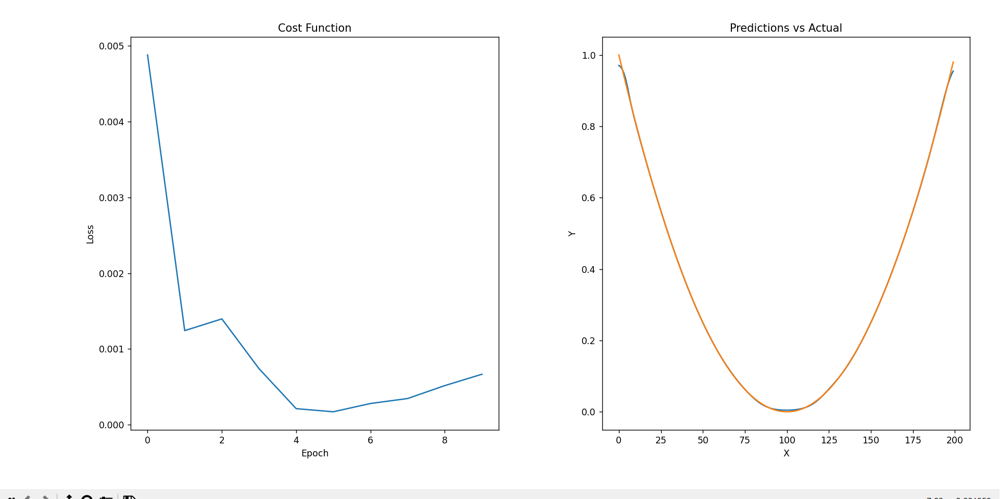

# _NN-reusable-version_

## Running
To run program write in the console:
```
python index.py
```

To train model write;
```
python training_test.py
```

# Structure

## Neural Network
It's a system of layers which allows us to train network \
by the process called [Backpropagation](#backpropagation) to adjust our model \
to solve current problem based on training set. Neural Networks have:
- input layer;
- hidden layers;
- output layer;

Where input layer is responsible for passing input data \
in the process of feeding forward to first hidden layer. \
 Data passed by [Activation Function](#activation-function) of each neuron in layer is next transport to \
 output layer which include our final result. Number of hidden layer, \
 their size, size of input and output layer, number of epoch \
in training loop and learning rate are called [Hyperparameters](#hyperparameters).

## Layer
Layer is set of neurons with same [Activation Function](#activation-function) and \
sizes.

```python
class Layer:
    def __init__(self, prev_size, size) -> None:
        self.size = size

        self.neurons = [Neuron(prev_size) for _ in range(size)]
        self.input = None
        self.output = None

    def forward(self, X):
        self.input = X.flatten()

        self.output = np.array([n.forward(self.input) for n in self.neurons])
        return self.output.flatten()
    
    def backprop(self, d_L_d_out, learning_rate):
            d_out_d_input = np.array([d_sigmoid(neuron.z) for neuron in self.neurons])

            d_L_d_input = d_L_d_out * d_out_d_input

            d_L_d_w = np.zeros_like(self.neurons[0].w)

            for i, neuron in enumerate(self.neurons):
                d_L_d_w += d_L_d_input[i] * neuron.w.flatten()
                neuron.backprop(d_L_d_input[i], learning_rate)

            return d_L_d_w
    
    
    def get_weights(self):
        return [neuron.get_weights() for neuron in self.neurons]

    def set_weights(self, weights_data):
        for i, neuron in enumerate(self.neurons):
            neuron.set_weights(weights_data[i])
```

## Neuron
Neuron is a single calculation unit that have:
- weights;
- bias;

Size of the weights depends on number of neurons in previous \
layer. Weights are typically some random value from Gauss \
curve. Bias is a single number initially 0.

Weights and biases are passed to the [Activation Function](#activation-function) \
which value is final neuron output.

```python
class Neuron:
    def __init__(self, input_size)-> None:
        self.w = np.random.rand(input_size)
        self.b = 0

        self.input = None
        self.d_l_d_w = None
        self.d_l_d_b = None
        self.z = None
        self.output = None

    def calcualte_z(self, X):
        """Calculating sum of Wi multiplied by Xi and b"""
        self.z = np.dot(self.w, X) + self.b
        return self.z

    def forward(self, X):
        self.input = X
        self.calcualte_z(X)

        self.output = sigmoid(self.z)
        return self.output
    
    def backprop(self, d_L_d_out, learning_rate):
        d_out_d_z = d_sigmoid(self.z)

        d_L_d_z = d_L_d_out * d_out_d_z

        for i in range(len(self.w)):
            self.w[i] += learning_rate * d_L_d_z * self.input[i]
        
        self.b += learning_rate * d_L_d_z

        return d_L_d_z * self.w.flatten()
    
    def get_weights(self):
        return {"weights": self.w.tolist(), "bias": self.b.tolist()}

    def set_weights(self, weights_data):
        self.w = np.array(weights_data["weights"])
        self.b = np.array(weights_data["bias"])
```

## Hyperparameters
Hyperparameters are parameters that described structure \
and working mechanism of our network.
- learning rate - describe how fast our model must learn from the training data. It's multiplier that we are using \
training each neuron;
- epochs - number of epochs in training loop;
- input size - size of input data that we are passing to \
the network;
- output size - expected size of output from our model;
- hidden neurons - number of neurons in each hidden layer;
- hidden size - number if hidden layer

# Cost Function
Cost function is a function that measures how our predictions \
are diffrent from expected value.

In our case I chose [Mean Squared Error(MSE)](https://pl.wikipedia.org/wiki/Błąd_średniokwadratowy):
```python
def mse_loss(y, pred):
    return (y - pred)**2
```

# Activation Function
Activation function is a function that according to \
in our neural network we are calculating output of each neuron \

In our case I chose [Hyperbolic Tangent Function](https://mathworld.wolfram.com/HyperbolicTangent.html):
```python
def tanh(x):
    return np.tanh(x)
```

# Backpropagation
It's a process of learning our neural network. It relies on \
calculating gradient of [Cost Function](#cost-function) in \
view of each weight and gradient and next to substract value \
of weight by this gradient. This allow our model to adjust \
to training data set and predict the next value. Alghoritm \
that use this problem approach is called [Gradient descent](https://en.wikipedia.org/wiki/Gradient_descent)

To calculate gradients I'm using following equations:

Activation Function:
```python
def d_tanh(x):
    return 1 - np.tanh(x)**2
```

Cost Function:
```python
def d_mse_loss(y, pred):
    return -2*(y-pred)
```

Layer:
```python
def backprop(self, d_L_d_out, learning_rate):
        d_out_d_input = np.array([d_sigmoid(neuron.z) for neuron in self.neurons])

        d_L_d_input = d_L_d_out * d_out_d_input

        d_L_d_w = np.zeros_like(self.neurons[0].w)

        for i, neuron in enumerate(self.neurons):
            d_L_d_w += d_L_d_input[i] * neuron.w.flatten()
            neuron.backprop(d_L_d_input[i], learning_rate)

        return d_L_d_w
```

Neuron:
```python
def backprop(self, d_L_d_out, learning_rate):
    d_out_d_z = d_sigmoid(self.z)

    d_L_d_z = d_L_d_out * d_out_d_z

    for i in range(len(self.w)):
        self.w[i] += learning_rate * d_L_d_z * self.input[i]
    
    self.b += learning_rate * d_L_d_z

    return d_L_d_z * self.w.flatten()
```

# Result

In our project I use [matplotlib.pyplot](https://matplotlib.org/3.5.3/api/_as_gen/matplotlib.pyplot.html) library to visualise our final effect \
As we can se network is rapidly learning how to adjust to \
our training data which are square function arguments and value \
Network result in my opinion is satisfying.



On the left Cost Function chart which collect cost value \
every 500 epoch.

On the right tally of prediction vs actual values. Where:
- Blue - predicted
- Orange - actual
